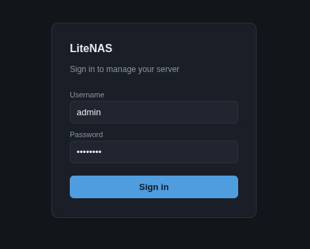
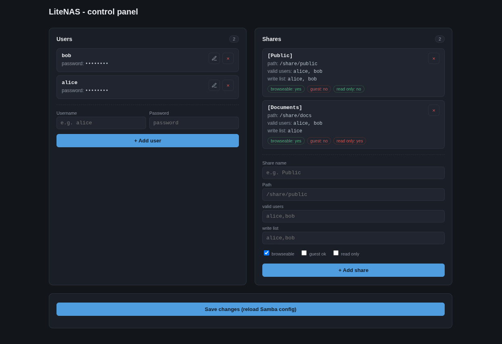

# Simple NAS

Simple lightweight NAS file server based on Samba running inside a Docker container. Works on any system capable of running Docker

The container uses the `dperson/samba` image and exposes selected host directories as network shares.

There is available web configuration:

- Login panel


- Configuration panel


## Features

- Docker-based deployment
- Persistent storage
- Multi-user support
- Multiple shares
- Web configuration panel
- Lightweight

## Requirements
- Docker
- Docker Compose
- Python
- OpenSSL
- Internet connection for initial setup

---

## Installation

Clone the repository:  
```bash
git clone https://github.com/aasiop/simple-nas.git
```

Enter repository:  
```bash
cd simple-nas
```

Run the setup script. It will interactively ask for the server name, host directory and website administrator credentials, then generate the .env and smb.conf files automatically.  
```bash
./setup.sh
```

Start the container:
```bash
docker compose up -d
```

Verify that the container is running:
```bash
docker ps
```

After starting the container, open the web configuration panel to configure users and shares.

---

## Configuration

To enter NAS share configuration, type:
```text
http://localhost:8000/
```

Or on another machine in the same network:
```text
http://SERVER_IP:8000/
```

---

## Accessing the Shares

### Windows
Open File Explorer and enter:
```text
\\SERVER_IP\SHARE_NAME
```

Example:
```text
\\192.168.1.50\home-nas
```

Then enter the configured user credentials

### Linux
Open your file manager and connect to:
```text
smb://SERVER_IP/SHARE_NAME
```

or mount it manually:
```bash
sudo mount -t cifs //SERVER_IP/SHARE_NAME /mnt/SHARE_NAME
```

---

## Debug
If Windows cannot find the shared folder, try:
```cmd
net use * /delete
```
Warning: This will disconnect all active SMB network connections.

---

If port 8000 is already in use, you can change the web panel port:

in `web_server.py` port 8000 (last line):
```text
app.run(host='0.0.0.0', port=8000, debug=False)
```

in `Dockerfile` replace 8000 with new port number (do not change 445!):
```text
EXPOSE 445 8000
```

in `compose.yaml` replace port 8000:8000 with new port numer (do not change 445:445!):
```text
ports:
  - "445:445"
  - "8000:8000"
```

---

If you encounter any problems with .env file configuration see example:
```env
SERVER_NAME=home-nas
HOST_PATH=/mnt/storage

USER_ID=1000
GROUP_ID=1000

SECRET_KEY=REPLACE_ME_generate_with_secrets
ADMIN_USER=admin
ADMIN_PASSWORD_HASH=REPLACE_ME_generate_with_werkzeug

...
```

| Variable              | Description                          |
|-----------------------|--------------------------------------|
| `SERVER_NAME`         | Docker container name                |
| `HOST_PATH`           | Directory on the host to share       |
| `USER_ID`             | Linux user ID                        |
| `GROUP_ID`            | Linux group ID                       |
| `SECRET_KEY`          | Random string for session management |
| `ADMIN_USER`          | Login name of admin user             |
| `ADMIN_PASSWORD_HASH` | Password hash                        |

Use these commands for:
- secret key:
```bash
python3 -c "import secrets; print(secrets.token_hex(32))"
```
- admin password:
```bash
python3 -c "from werkzeug.security import generate_password_hash as g; print(g('your password'))"
```


## License
This project is licensed under the MIT License.